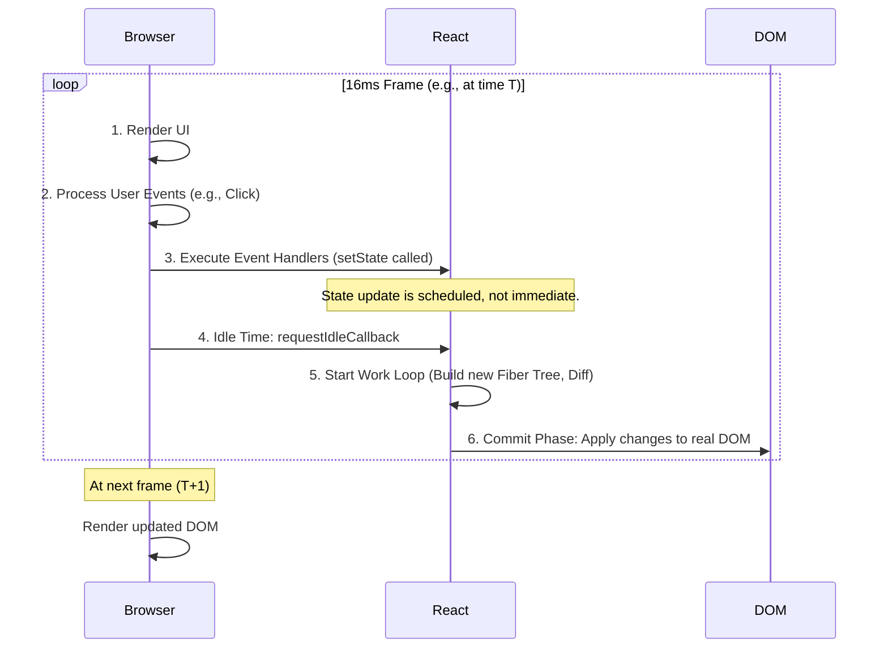
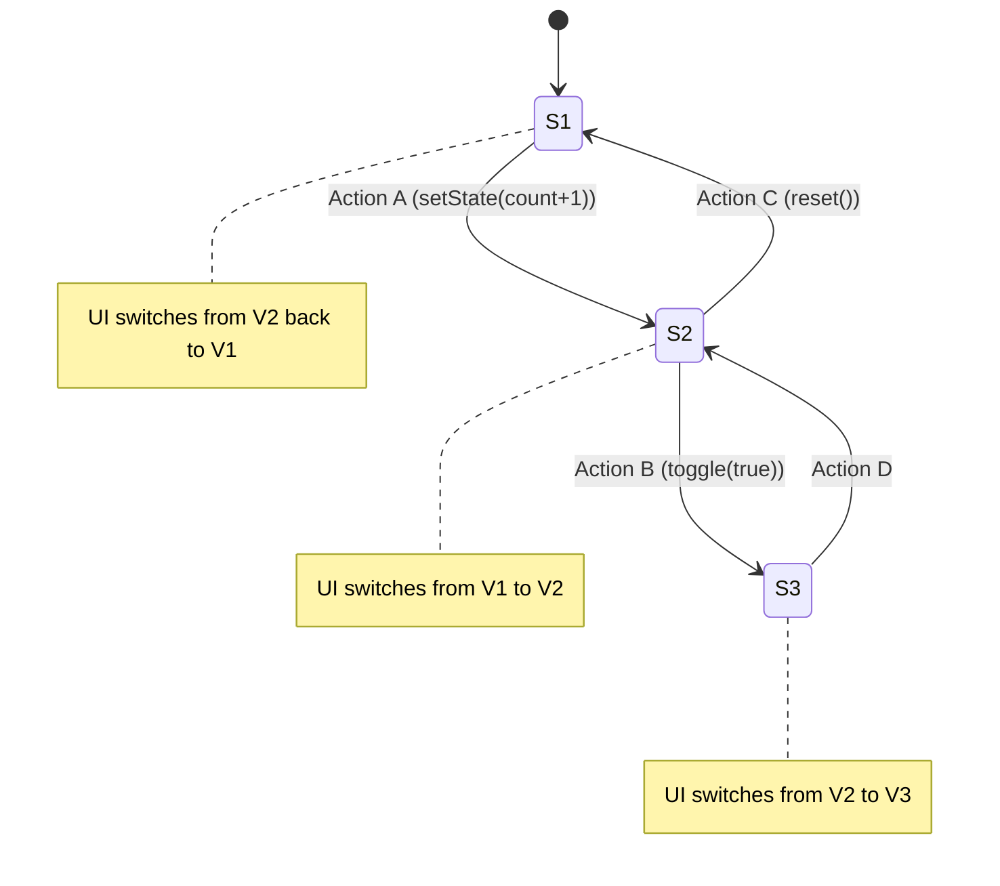

# React 组件时间线与状态机模型深度解析

## 一、 浏览器渲染与 React 工作循环

### 1\. 浏览器事件循环与渲染帧

浏览器以大约 **16ms** 为一帧的节奏进行渲染和更新。一个典型的 16ms 帧内，浏览器的主要工作可分为：

1.  **渲染 (Render):** 执行必要的绘制操作，更新屏幕显示。
2.  **事件处理 (Event Handling):** 处理用户的交互，如点击、滚动等，并执行对应的 `handler` 函数。
3.  **宏任务与微任务 (Task Queues):** 处理 `setTimeout`、`Promise` 等异步队列中的任务。
4.  **空闲时间 (Idle Time):** 在完成上述任务后，若仍有剩余时间，浏览器会进入空闲状态。

### 2\. React 的接管与 Work Loop

React 框架利用浏览器的**空闲时间**来执行其核心工作，这通过 `requestIdleCallback` API（或其内部实现）来调度。

  - **接管时机:** 在浏览器一帧的空闲时间段开始。
  - **核心任务:** 执行 **Work Loop**，即 React 的\*\*协调（Reconciliation）\*\*过程。
  - **过程:**
    1.  在 Work Loop 中，React 开始构建新的 **Fiber Tree**（虚拟 DOM 的升级版）。
    2.  通过 **Diffing 算法**，比较新旧两棵 Fiber Tree 的差异。
    3.  计算出需要对真实 DOM 进行的最小化修改。
  - **中断与恢复:** 如果一帧的空闲时间不足以完成整个 Work Loop，React 会将任务中断，并等待下一帧的空闲时间继续执行，从而避免阻塞浏览器渲染。

### 3\. DOM 更新与渲染

1.  **计算完成:** 在 Work Loop 中计算出所有 DOM 变更后。
2.  **统一提交 (Commit):** React 会将所有计算出的变更**一次性、同步地**应用到真实 DOM 上。
3.  **浏览器渲染:** 在下一次渲染帧（例如 `T+1` 时刻），浏览器会绘制这些已修改的 DOM，用户就能看到更新后的 UI。

<!-- end list -->



## 二、 React 状态机模型

### 1\. 从连续到离散的抽象

尽管底层的执行过程（Work Loop、DOM 操作）是复杂且连续的，但 React 从逻辑上将其**等效和简化**为一个离散的模型。

  - **核心思想:** 将所有复杂的中间过程“拍扁”到一个**时间点**（如 `T` 时刻）。
  - **开发者视角:**
      - 在 `T` 时刻，函数组件被执行，它基于**当前时刻的 `props` 和 `state`**（这些值在本轮渲染中是**常量**）计算出 UI。
      - 用户的交互（如在 `T+0.3` 时刻点击按钮并调用 `setState`）会触发一个**状态转移**的请求。
      - React 调度这次更新，并在未来的某个时间点（如 `T+1`）应用这个变更，并重新执行函数组件，生成新的 UI。

### 2\. 状态机 (State Machine) 的核心要素

React 组件的行为可以被完美地建模为一个**状态机**。

  - **状态 (State - S):** 组件所有 `props` 和 `hooks` (如 `useState`) 值的集合。在任意一帧内，状态 `S` 是一个**不可变的常量**。例如 `S1`, `S2`, `S3` 代表了所有可能的状态。
  - **行为 (Action):** 触发状态变化的事件，通常来自事件处理器 (`onClick`) 或副作用 (`useEffect`) 中调用的 `setState` 函数。
  - **转移 (Transition):** 一个 `Action` 会导致状态从一个点 (`S1`) 跳转到另一个点 (`S2`)。**React 不会修改（mutate）旧状态，而是创建一个全新的状态对象。**
  - **UI (View - V):** UI 是状态的**纯函数映射**。每一个确定的状态 `S`，都命中注定地对应一个确定的 UI `V`。即 `V = f(S)`。

**核心逻辑：** 状态变化（`S1` -\> `S2`）不是去“修改”UI，而是直接“切换”到新状态对应的全新 UI（`V1` -\> `V2`）。



## 三、 Hooks 执行时间线详解

以下以一个包含多种 Hooks 的组件为例，分析其在不同生命周期阶段的执行顺序。

### 1\. 挂载 (Mount) 阶段

组件首次被渲染到屏幕上。

1.  **Render 阶段:**
      - React 执行函数组件代码，所有局部变量被计算。
      - `useState`, `useMemo` 等 Hooks 被调用和初始化。
      - 函数返回 `React Element` 对象。
2.  **Commit 阶段 (按顺序):**
      - **DOM 更新:** React 将 `Element` 对应的真实 DOM 节点插入到文档中。
      - **`useRef` 赋值:** 如果有 `ref`，React 将创建好的 DOM 节点赋值给 `ref.current`。
      - **`useLayoutEffect` 执行:**
          - 在浏览器**绘制之前**同步执行。
          - 适合用于读取 DOM 布局信息并**同步**修改 DOM，以防止页面闪烁。
          - 例如：初次渲染后发现文本溢出，需要在此处立即调整样式。
      - **浏览器绘制 (Paint):** 浏览器将内存中的 DOM 树绘制到屏幕上。
      - **`useEffect` 执行:**
          - 在浏览器**绘制之后**异步执行。
          - 不会阻塞浏览器渲染，适合绝大多数副作用，如数据获取、事件订阅等。

### 2\. 更新 (Update) 阶段

当组件的 `props` 或 `state` 发生变化时。

1.  **Render 阶段:**
      - React 再次执行函数组件，基于**新的 `props` 和 `state`** 计算出新的 `React Element`。
2.  **Commit 阶段 (按顺序):**
      - **`useEffect` / `useLayoutEffect` 清理:** 执行上一轮渲染中 `useEffect` / `useLayoutEffect` 返回的清理函数。
      - **DOM 更新:** React 执行 Diffing 算法，并将差异应用到真实 DOM。
      - **`useRef` 更新:** 如果 `ref` 指向的 DOM 节点变化，则更新 `ref.current`。
      - **`useLayoutEffect` 执行:** 再次在浏览器绘制前同步执行新一轮的 `useLayoutEffect`。
      - **浏览器绘制 (Paint):** 浏览器绘制更新后的 UI。
      - **`useEffect` 执行:** 再次在浏览器绘制后异步执行新一轮的 `useEffect`。

### 3\. 卸载 (Unmount) 阶段

组件从屏幕上移除。

1.  **Commit 阶段:**
      - **`useEffect` / `useLayoutEffect` 清理:** 执行最后一次渲染留下的 `useEffect` 和 `useLayoutEffect` 的清理函数，用于取消订阅、清除定时器等。
      - **DOM 移除:** React 将组件对应的 DOM 节点从文档中移除。

## 四、 性能优化与不可变性

### 1\. 优化的陷阱: `useMemo` & `React.memo`

> 过早的优化是万恶之源。 — Donald Knuth

`useMemo` 和 `React.memo` 是为性能优化而生的，但极易被误用。它们的核心是**缓存（记忆化）**，通过避免不必要的计算或渲染来提升性能。

**核心原理：引用相等性 (Referential Equality)**

React 判断 `props` 或 `useMemo` 的依赖项是否变化，默认使用的是 `Object.is` 比较，即比较它们的**内存地址**是否相同。

**常见误用场景：**

  - **父组件重渲染导致子组件无效 memo：** 如果父组件重渲染，即使传递给子组件的 `props` 值没变，但如果它是对象或函数，它的引用（内存地址）会发生变化，导致 `React.memo` 失效。

    ```javascript
    // 父组件
    function App() {
      const [size, setSize] = useState(20);

      // 每次 App 重渲染，item 都是一个新对象，即使值一样
      const item = { name: 'fixed' };
      // 每次 App 重渲染，handleClick 都是一个新函数
      const handleClick = () => console.log('clicked');

      return (
        <div>
          <button onClick={() => setSize(s => s + 1)}>Grow</button>
          {/* MemoizedComponent 依然会重渲染，因为 props 的引用变了 */}
          <MemoizedComponent item={item} onClick={handleClick} />
        </div>
      );
    }
    ```

**正确的使用姿势：**

要使记忆化生效，必须保证所有非原始类型的 `props`（对象、数组、函数）的引用在不必要的情况下保持稳定。

  - 使用 `useMemo` 缓存对象和数组。
  - 使用 `useCallback` 缓存函数。

<!-- end list -->

```javascript
function App() {
  const [size, setSize] = useState(20);

  // 使用 useMemo 保证 item 对象的引用稳定
  const item = useMemo(() => ({ name: 'fixed' }), []);

  // 使用 useCallback 保证 handleClick 函数的引用稳定
  const handleClick = useCallback(() => console.log('clicked'), []);

  return (
    <div>
      <button onClick={() => setSize(s => s + 1)}>Grow</button>
      {/* 现在 MemoizedComponent 仅在 props 真正变化时才重渲染 */}
      <MemoizedComponent item={item} onClick={handleClick} />
    </div>
  );
}
```

**更优的优化策略：**

1.  **状态下放 (State Colocation):** 将状态移动到真正需要它的最小组件中，从源头上避免不必要的父组件重渲染。
2.  **内容提升 / Children 作为 Props:** 将动态变化的部分作为 `children` 传入，这样父组件即使重渲染，`children` 的引用不变，包裹的组件也不会重渲染。

### 2\. 不可变性 (Immutability)

**不可变性**是 React 状态管理的核心原则。它意味着**永远不要直接修改 `state` 或 `props`**，而是要创建它们的副本，并在副本上进行修改。

**为什么重要？**

  - **简化变更检测:** React 依赖**引用比较**来高效地检测状态是否变化。如果原地修改对象，其引用不变，React 会认为没有发生变化，导致 UI 不更新。
  - **可追溯性与调试:** 状态的每一次变化都是一个全新的快照，便于追踪历史、实现撤销/重做等功能。
  - **符合状态机模型:** 状态跳转的本质就是从一个不可变的状态切换到另一个。

**实践中的挑战：深层嵌套更新**

当状态对象嵌套很深时，手动创建副本会变得非常繁琐和易错。

```javascript
// 原地修改 (错误!)
const state = { user: { name: 'A', address: { city: 'B' } } };
state.user.address.city = 'C'; // 错误，引用未变，React 看不到更新

// 不可变更新 (正确但繁琐)
const newState = {
  ...state, // 复制第一层
  user: {
    ...state.user, // 复制第二层
    address: {
      ...state.user.address, // 复制第三层
      city: 'C' // 在新副本上修改
    }
  }
};
```

### 3\. 使用 Immer 简化不可变更新

**Immer** 是一个流行的库，它允许你用看似“可变”的、直观的方式来编写代码，而它在底层会自动处理不可变更新的复杂性。

```javascript
import { produce } from 'immer';

const originalState = { user: { name: 'A', address: { city: 'B' } } };

const nextState = produce(originalState, draftState => {
  // 你可以像直接修改对象一样编写代码
  // Immer 会确保 originalState 不被触动，并返回一个全新的 nextState
  draftState.user.address.city = 'C';
});

// 结果：
// originalState 依然是 { user: { name: 'A', address: { city: 'B' } } }
// nextState 是一个全新的对象，包含了更新
console.log(originalState.user.address.city); // "B"
console.log(nextState.user.address.city);     // "C"
console.log(originalState === nextState);       // false
```