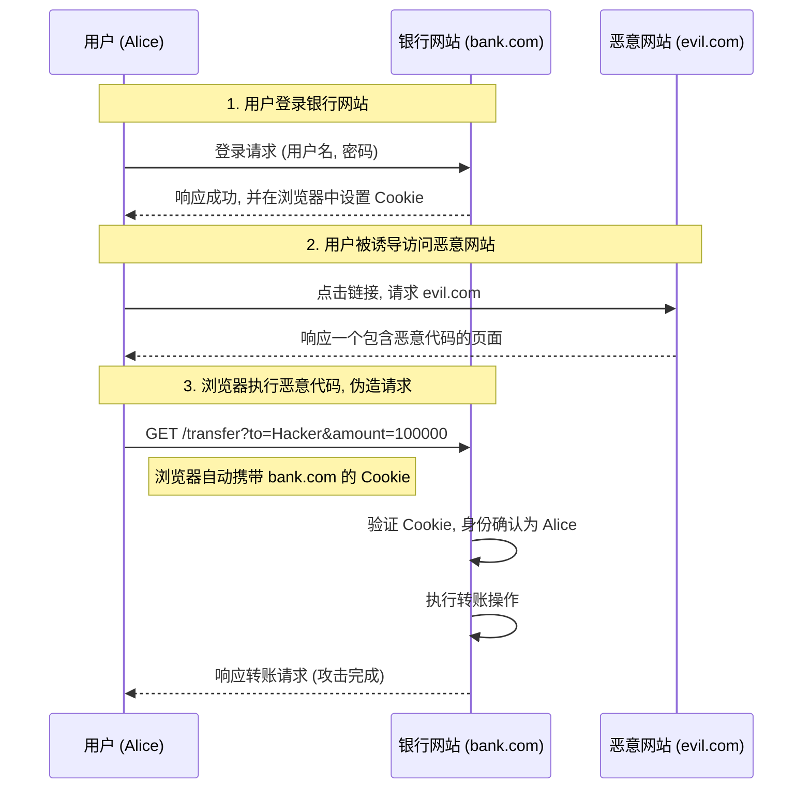

# CSRF (Cross-Site Request Forgery) 攻击深度解析

## 一、 什么是 CSRF 攻击？

**CSRF (Cross-Site Request Forgery)**，中文译为 **跨站请求伪造**。这是一种低成本、高危害、影响巨大的网络攻击方式。

  - **核心思想**：攻击者盗用受信任用户的身份，以该用户的名义发送恶意请求。
  - **关键利用点**：利用了浏览器在发送跨域请求时会自动携带目标站点 **Cookie** 的特性。
  - **用户状态**：用户在整个攻击过程中通常是 **无感知** 的，他可能只是点击了一个看似无害的链接或加载了一个页面。
  - **攻击效果**：执行用户非本意的操作，如修改密码、发起转账、删除数据等。

> **历史背景**:
>
>   - **国外**: 2000年首次被发现。
>   - **国内**: 2006年左右开始受到关注。
>
> 如今，主流后端框架都已内置了 CSRF 防护机制。

-----

## 二、 攻击原理与流程

CSRF 攻击的成功依赖于三个关键步骤：

1.  **用户登录受信任站点**：用户 `Alice` 登录了银行网站 `bank.com`。服务器验证通过后，在浏览器中写入了包含身份认证信息（如 `token`）的 Cookie，该 Cookie 的作用域为 `bank.com`。

2.  **用户访问恶意站点**：在不退出 `bank.com` 的情况下，`Alice` 被一个诱人的标题（“十个男人九个受不了！”）吸引，点击并访问了攻击者 `Hacker` 搭建的恶意网站 `evil.com`。

3.  **恶意站点伪造请求**：`evil.com` 页面中包含了向 `bank.com` 发起请求的恶意代码。当浏览器加载 `evil.com` 时，这段代码会自动执行。

#### 流程图解



-----

## 三、 攻击代码实现

攻击者有多种方式在恶意页面中嵌入伪造的请求，即使用户不可见。

#### 1\. 利用 `` 标签 (GET 请求)

这是最简单的方式，攻击者将请求伪装成一个图片链接。浏览器在解析 `` 的 `src` 属性时会自动发起 GET 请求。

```html
<h1>男人看了沉默，女人看了流泪...</h1>


```

#### 2\. 利用自动提交的表单 (POST 请求)

如果服务器的关键操作（如转账）只接受 POST 请求，攻击者可以创建一个自动提交的表单。

```html
<form id="csrf-form" action="https://bank.com/transfer" method="POST">
    <input type="hidden" name="to" value="Hacker" />
    <input type="hidden" name="money" value="1000000" />
</form>

<script>
    // 页面加载后立即自动提交表单
    document.getElementById('csrf-form').submit();
</script>
```

为了让用户无感知，攻击者可以将这个表单放在一个隐藏的 `<iframe>` 中加载。

**主页面 (`evil.com/index.html`):**

```html
<iframe src="evil.com/attack.html" style="display:none;"></iframe>
```

**Iframe 页面 (`evil.com/attack.html`):**

```html
<form action="https://bank.com/transfer" method="POST">
    <input type="hidden" name="to" value="Hacker" />
    <input type="hidden" name="money" value="1000000" />
</form>
<script>
    document.forms[0].submit();
</script>
```

-----

## 四、 防御策略

### 方案一：不使用 Cookie，改用 `localStorage` (釜底抽薪)

CSRF 攻击的根源在于浏览器会自动发送 Cookie。如果身份令牌不存储在 Cookie 中，问题就迎刃而解。

  - **做法**：登录后，服务器将 `token` 返回给前端，前端将其存储在 `localStorage` 中。之后每次请求，都通过 JavaScript 从 `localStorage` 中读取 `token`，并将其放入请求头（如 `Authorization`）中发送。
  - **优点**：从根本上杜绝了 CSRF 攻击，因为浏览器不会自动发送 `localStorage` 中的数据。
  - **缺点**：
    1.  **兼容性略差**：`localStorage` 是 H5 标准，非常古老的浏览器（如 IE6/7）不支持。
    2.  **SSR (服务端渲染) 会遇到困难**：
          - **客户端渲染 (CSR)**：服务器返回空 `html` 和大量 `js`，页面 DOM 在客户端生成。
          - **服务端渲染 (SSR)**：服务器直接生成完整的 `html` 结构返回给浏览器，有利于 SEO。
          - **问题所在**：在 SSR 模式下，当用户首次请求页面时，服务器需要知道用户的登录状态来渲染不同内容。但由于 `token` 在客户端的 `localStorage` 里，首次请求无法携带，服务器无法判断登录状态，导致实现起来更复杂。

### 方案二：使用 Cookie 的 `SameSite` 属性

`SameSite` 是一个可以设置在 Cookie 上的属性，用于声明该 Cookie 不应随跨站请求一起发送，专门用于防御 CSRF。

  - `SameSite=Strict`：**最严格**。完全禁止第三方 Cookie。只有当前网页的 URL 与请求目标的 URL 完全一致时，Cookie 才会发送。这种模式可能导致一些正常的跨站链接跳转后用户状态丢失。
  - `SameSite=Lax`：**宽松模式 (常用)**。允许用户从外部站点导航到目标网站时发送 Cookie（如点击链接），但限制了 `POST`、`PUT` 等可能修改数据的请求。这是目前许多浏览器的默认设置。
  - `SameSite=None`：允许在任何跨站请求中发送 Cookie，但必须同时指定 `Secure` 属性（即只能在 HTTPS 中使用）。

**优点**：防御效果好，由浏览器原生支持。
**缺点**：存在浏览器兼容性问题；`Strict` 模式过于严格，可能会“挡住自己人”，影响正常的跨站业务。

### 方案三：CSRF Token (Synchronizer Token Pattern - 同步令牌模式)

这是目前最主流、最通用的解决方案。

  - **核心流程**：

    1.  **颁发令牌**：用户访问一个需要保护的页面时（如转账表单页），服务器生成一个随机、一次性的 `CSRF Token`。
    2.  **传递令牌**：服务器将此 `Token` 嵌入到返回的 HTML 中（通常是一个隐藏的 `input` 字段），同时在服务器端的 `Session` 中保存一份。
        ```html
        <form action="/transfer" method="post">
            <input type="hidden" name="csrf_token" value="a_very_long_and_random_string_12345">
            </form>
        ```
    3.  **验证令牌**：用户提交表单时，这个 `csrf_token` 会随表单一并发送给服务器。
    4.  **服务器比对**：服务器接收到请求后，会比较表单中的 `Token` 与 `Session` 中存储的 `Token` 是否一致。
          - **一致**：请求合法，执行操作。
          - **不一致或不存在**：请求为伪造，拒绝执行。

  - **为什么有效**：攻击者的 `evil.com` 无法获取到这个由 `bank.com` 动态生成的 `Token`，因此其伪造的请求中必然缺少或包含了错误的 `Token`，从而被服务器拦截。

  - **潜在风险**：存在一个极小的攻击窗口。如果用户先打开了银行的转账页面（获取了有效 Token），在没有提交转账操作的情况下，又立刻访问了恶意网站，此时恶意网站发起的攻击请求可能会成功。但这个场景发生概率极低，并且可以通过**对关键操作增加二次验证**（如输入支付密码、手机验证码）来完全规避。

### 方案四：检查 `Referer` (不推荐使用)

`Referer` 是 HTTP 请求头的一部分，它记录了该请求的来源页面地址。

  - **做法**：服务器检查请求头中的 `Referer` 字段，如果其值不是本站域名，就判定为非法请求。

  - **为什么不推荐**：这种方法存在漏洞。

    1.  `Referer` 头是可选的，用户可以配置浏览器不发送 `Referer`。
    2.  **可以被绕过**：通过特定技术（如使用 `data:` URI），攻击者可以构造出不带 `Referer` 头的请求，从而绕过此项检查。

    <!-- end list -->

    ```html
    <iframe src="data:text/html;base64,PGZvcm0gYWN0aW9uPSJodHRwczovL2JhbmsuY29tL3RyYW5zZmVyIiBtZXRob2Q9IlBPU1QiPjxpbnB1dCB0eXBlPSJoaWRkZW4iIG5hbWU9InRvIiB2YWx1ZT0iSGFja2VyIj48L2Zvcm0+PHNjcmlwdD5kb2N1bWVudC5mb3Jtc1swXS5zdWJtaXQoKTwvc2NyaXB0Pg=="></iframe>
    ```

-----

## 五、 面试问题总结

**当面试官问：请谈一谈你对 CSRF 攻击的理解？**

你可以这样回答：

1.  **是什么 (What)**：CSRF 全称是跨站请求伪造。它的核心是攻击者利用了用户已登录的身份（浏览器会自动携带目标网站的 Cookie），诱导用户访问一个恶意页面，由这个页面以用户的名义向目标网站发起一个用户非本意的请求，比如转账、改密码等。

2.  **如何攻击 (How)**：举一个典型的例子：

      * 用户先登录了 `bank.com`。
      * 然后用户被诱导访问了攻击者的网站 `evil.com`。
      * `evil.com` 上有一个隐藏的 `` 标签或一个自动提交的 `form`，它的请求地址是 `bank.com` 的转账接口。
      * 浏览器在加载这个资源时，会向 `bank.com` 发起请求，并且因为同站策略，会自动带上 `bank.com` 的 Cookie。
      * `bank.com` 的服务器看到请求中带有合法的 Cookie，就误以为是用户本人在操作，从而执行了转账，攻击就成功了。

3.  **如何防御 (Defense)**：主要的防御方式有三种：

      * **CSRF Token**：这是最经典和通用的方法。服务器在返回重要操作页面时，会附带一个随机的、一次性的 Token。用户提交时必须带上这个 Token，服务器会进行验证。攻击者无法获取这个 Token，所以伪造的请求会被拦截。
      * **SameSite Cookie 属性**：通过设置 Cookie 的 `SameSite` 属性为 `Lax` 或 `Strict`，可以命令浏览器在跨站请求中不要携带 Cookie，从而从根源上阻止攻击。
      * **不使用 Cookie**：对于前后端分离的应用，可以将身份验证的 `Token` 存储在 `localStorage` 中，并通过请求头（`Authorization`）手动发送，完全绕开 Cookie 的自动发送机制。
      * （可以补充）对于非常核心的操作，比如支付，还需要**二次验证**，比如输入密码或短信验证码，作为最后一道防线。