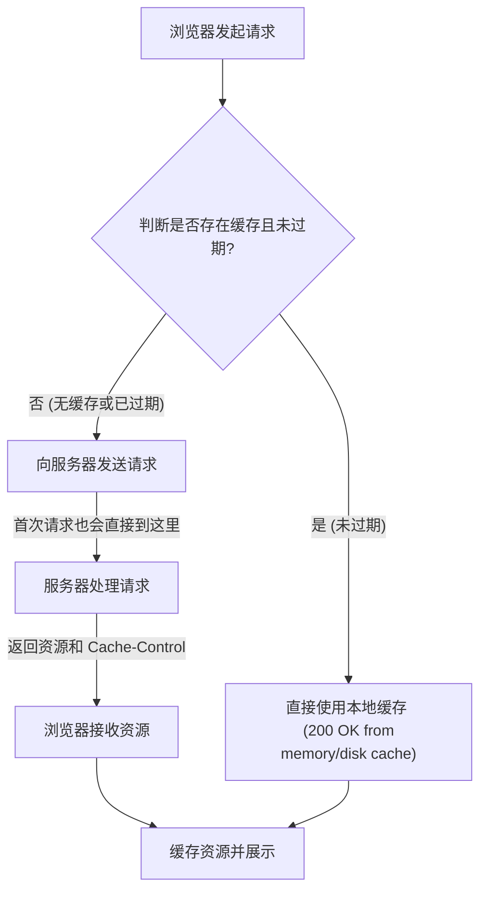
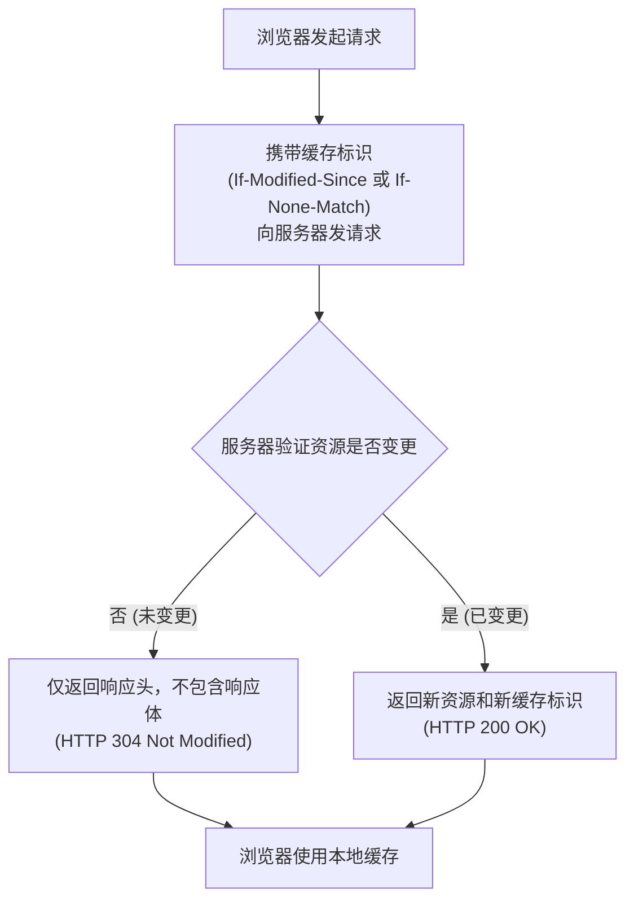

# HTTP 缓存核心概念解析

HTTP 缓存是优化 Web 性能的重要手段，主要分为 **强缓存** 和 **协商缓存** 两种。结合图解和实例，深入剖析这两种缓存的工作机制。

## 一、 强缓存 (Strong Cache)

强缓存的核心思想是：在缓存有效期内，浏览器不向服务器发送任何请求，直接从本地缓存中读取资源。

### 工作流程

### 核心响应头：`Cache-Control`

服务器通过在响应头中添加 `Cache-Control` 字段来启用强缓存。

-   **关键指令**: `max-age=<seconds>`，用于指定资源的有效时间（单位：秒）。一旦设置，在指定时间内，浏览器将不再向服务器发起请求。
-   **示例**: `Cache-Control: max-age=3600` 表示该资源可以被强缓存一小时。文稿中的示例就是通过 Node.js 设置了这个响应头。

### 场景应用

适用于不经常变更的静态资源，例如网站 Logo、字体文件、样式表、第三方库文件等。通过设置较长的缓存时间，可以显著减少服务器请求，节省服务器资源，提升加载速度。

## 二、 协商缓存 (Negotiation Cache)

协商缓存的核心思想是：浏览器每次都会向服务器发送请求，但服务器会根据资源是否发生变化来决定是返回新资源（HTTP 200），还是告知浏览器使用本地缓存（HTTP 304）。

### 工作流程

### 核心请求/响应头

协商缓存通常由以下两组配套的头部字段控制：

1.  **`Last-Modified` / `If-Modified-Since`**
    -   `Last-Modified` (响应头): 资源在服务器上最后一次被修改的时间。
    -   `If-Modified-Since` (请求头): 浏览器在后续请求中携带上次收到的 `Last-Modified` 值，询问服务器此时间后资源是否有更新。

2.  **`ETag` / `If-None-Match` (更优方案)**
    -   `ETag` (响应头): 服务器为资源生成的唯一标识（类似内容的哈希值）。只要资源内容改变，`ETag` 就会改变。
    -   `If-None-Match` (请求头): 浏览器在后续请求中携带上次收到的 `ETag` 值，询问服务器该标识是否仍匹配。

> **注意**: `ETag` 相比 `Last-Modified` 更精确，可以解决"文件修改时间变化但内容未变"，或者"修改时间无法精确到秒以下"等问题，因此在实践中更被推崇。

### 场景应用

适用于经常需要更新，但又希望尽可能利用缓存的资源。例如，用户可随时修改的头像、商品缩略图、文章内容等。通过每次与服务器确认，既能保证用户及时获取最新内容，又能在内容未变更时避免完整资源的重复传输，只传递一个极小的 304 响应。

## 三、 总结对比

| 特性 | 强缓存 (Strong Cache) | 协商缓存 (Negotiation Cache) |
| :--- | :--- | :--- |
| **是否发起HTTP请求** | 缓存有效时，**不**向服务器发请求 | **总是**向服务器发请求 |
| **服务器响应状态码** | - (请求未发出) | `HTTP 200` (资源更新) 或 `HTTP 304` (资源未变) |
| **性能开销** | 开销最小，直接从本地读取 | 有一次HTTP请求开销，但可能只传输头部，节省带宽 |
| **控制字段** | `Cache-Control`, `Expires` | `Last-Modified`/`ETag`, `If-Modified-Since`/`If-None-Match` |